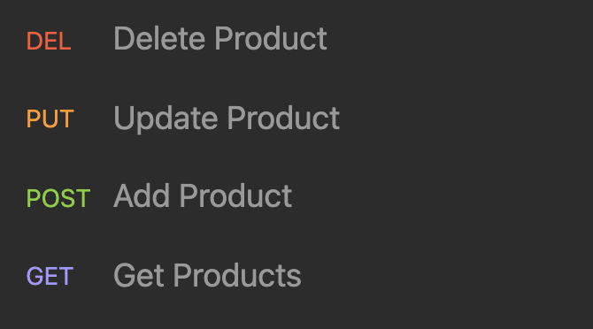
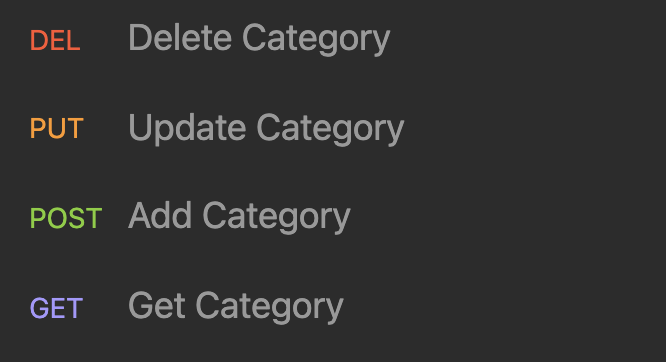
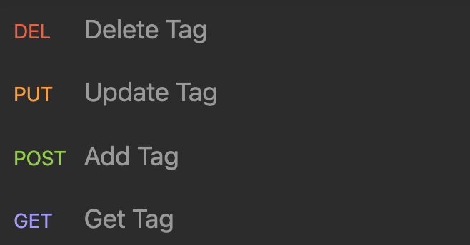

# E-Commerce Back End

This week's assignment was to design the back end of an ecommerce website. 

## Getting Started

To run the program you will need to build the database on your local machine. You can copy the schema provided in the db folder or you can run the file in your mysql shell. 

After you have built an instance of the database you can download the dependencies by running:

    npm i

Once the dependencies are installed you're going to want to populate your database with prewritten information. This can be done by running:

    npm run seed

Now you are ready to run the api. To launch the server run the following command:

    npm start

## Product Endpoints

At each of these end points we are able to get, add, update and delete products.

## Category Endpoints

At each of these end points we are able to get, add, update and delete categories.

## Tag Endpoints

At each of these end points we are able to get, add, update and delete Tags.

